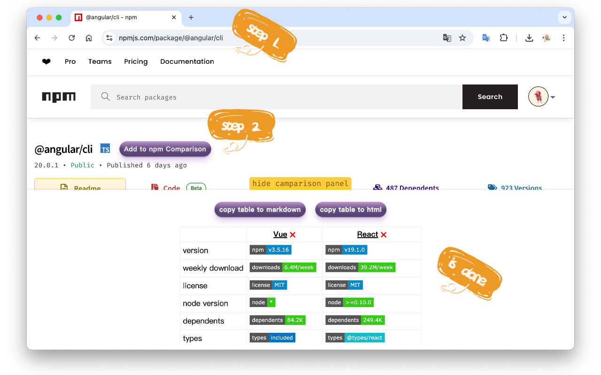

# Npm-Comparison

    <a href="hhttps://chromewebstore.google.com/detail/npm-comparison/opijdickacjhbendcbbabpgffoppphdg?authuser=0&hl=zh-CN" target="_blank">
     Chrome 商店安装
  </a>

A browser extension designed for comparing npm packages

一款用于快速制作精美的 npm 包对比表格的浏览器插件

### 🚀 功能亮点

只需点击几次鼠标就可以生成一份精美的 npm 包对比表格。

可以直接复制到 `Markdown` 文档或者 `HTML` 文档。

让你的技术调研报告看着 👍**高** 👍**大** 👍**上**

### 下面是一份简单的示例

|                 | [@angular/cli](https://www.npmjs.com/package/@angular/cli)                                                                                                               | [vue](https://www.npmjs.com/package/vue)                                                                                                                                             | [react](https://www.npmjs.com/package/react)                                                                                                    |
| --------------- | ------------------------------------------------------------------------------------------------------------------------------------------------------------------------ | ------------------------------------------------------------------------------------------------------------------------------------------------------------------------------------ | ----------------------------------------------------------------------------------------------------------------------------------------------- |
| version         |                                                                                                                    |                                                                                                                                         |                                                                                                  |
| weekly download |                                                                                                           |                                                                                                                                |                                                                                         |
| license         |                                                                                                              |                                                                                                                                   |                                                                                            |
| dependents      |                                                                                                        |                                                                                                                             |                                                                                      |
| types           |                                                                                                                  |                                                                                                                                       |                                                                                                |
| install size    |                                                                    |                                                                                                  |                                                         |
| stars           |  |  |  |
| last commit     |                                                                                            |                                                                                                                 |                                                                        |
| issues          |                                                                                                      |                                                                                                                           |                                                                                  |
| open issues     |                                                                                            |                                                                                                                 |                                                                        |
| closed issues   |                                                                                        |                                                                                                             |                                                                    |
